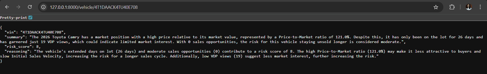
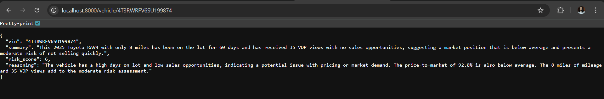

# Lotlinx Vehicle Summary API 🚗

## Project Overview
I built this project as part of the **Lotlinx Automotive AI Fellowship challenge** for the **Junior AI/ML Developer** position to showcase my practical coding skills, problem-solving ability in a relevant domain, and experience integrating with LLMs. The goal was to take raw vehicle data from a CSV file and, for any given VIN, I was suppose to generate a concise market summary along with a data-driven risk score.

To achieve this, I used **FastAPI** to design a clean and lightweight RESTful service, **pandas** to handle and preprocess the CSV data, and a **custom risk scoring heuristic** to capture important business signals (like days_on_lot, price_to_market, vdp_views, etc.). On top of that, I integrated with the **Mistral-7B LLM via Hugging Face Inference API** to generate natural language summaries and reasonings. The entire application is **containerized with Docker**, making it easy to set up and run anywhere.  

In short, this project brings together **data engineering, model integration, and API development** into a simple but powerful demonstration of how AI can help make smarter vehicle market decisions.

---

## Features
- RESTful API built with **FastAPI**. Just provide a VIN, and the API will fetch the vehicle record from the CSV dataset.
- CSV data ingestion - Vehicle data loaded from CSV (`sample_data.csv`).
- Cleans and preprocesses fields (price, days on lot, mileage, etc.) and converts them into usable numeric values.
- Calculates a **risk score** by applying a simple but effective heuristic to assign a score from 1–10, reflecting how the vehicle is positioned in the market.
- Calls an **LLM (Mistral-7B-Instruct)** via Hugging Face Inference API to generate:
  - `summary` → A short, human-readable summary of the vehicle's market position
  - `reasoning` → A clear, concise explanation for the assigned risk score
- Containerized with Docker for portability.

---

## ⚙️ Setup Instructions

### 1. Clone the Repository
```bash
git clone <this_repository_url>
cd <this_repository_name>
```

### 2. Set up Environment Variables 
(For this challenge submission, I provided HF_TOKEN in the email, copy & paste that token here.)

Create a .env file in the project root:
```bash
HF_TOKEN=your_huggingface_api_token
```

### 3. Run Locally (Without Docker)

-> Install dependencies
```bash
pip install -r requirements.txt
```

-> Run locally
```bash
uvicorn app.main:app --reload
```

### 4. Run with Docker 

-> Build image
```bash
docker build --no-cache -t lotlinx-vehicle .
```

-> Run container
```bash
docker run -p 8000:8000 --env-file .env lotlinx-vehicle
```

---

## 🚀 API Usage

### Endpoint

`GET /vehicle/{vin}`

---

## Example Request-Response

### Testing
- Ensure .env has a valid Hugging Face token before testing.
- Make sure your server is running locally (either with or without Docker).
- Enter a VIN from sample_data.csv to test the API.

### 🛠️ How It Works
1. The API reads vehicle data from the CSV file (sample_data.csv) and preprocesses key fields like price, mileage, days on lot, etc.
2. A custom risk scoring heuristic calculates a score from 1–10 based on business-relevant metrics.
3. The selected vehicle data and risk score are sent to the Mistral-7B LLM via Hugging Face Inference API, which generates a concise natural language summary and reasoning.
4. The API then returns a JSON response with the VIN, summary, risk score, and reasoning.

### Output Screenshot of Run Locally (Without Docker)


### Output Screenshot of Run with Docker


---

## 📌 Notes

- Risk score is a heuristic approximation and may differ across VINs.
- LLM output depends on Hugging Face’s inference service availability.
- This project is for demonstration purposes within the Lotlinx AI/ML Fellowship assessment.


